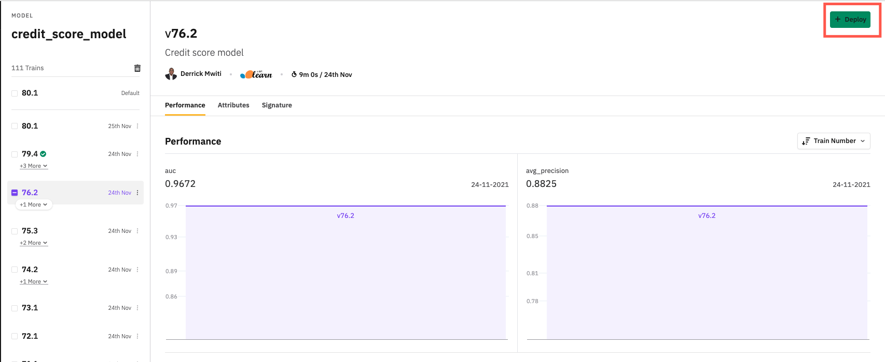

## Tutorial 0: How to create a credit score model in Layer
A project showing how to create a credit score model with Layer. The project uses the [Home Credit Default Risk dataset](https://www.kaggle.com/c/home-credit-default-risk/overview)
that is hosted on [Kaggle](https://www.kaggle.com/c/home-credit-default-risk/overview). 

### What are we going to learn?
- Create features in Python
- Injecting features and datasets to the model train function
- Using multiple datasets and featuresets in a Layer project
- Experimentation tracking with
    - logging model parameters
    -  logging model evaluation metrics

### Installation & running
To check out the Layer cats and dogs example, run:
```yaml
git clone https://github.com/layerml/credit-score.git
cd credit-score/main-project
```
To build the project:
```yaml
layer login
layer start
```

File structure:
```yaml
.
|____.layer
| |____project.yaml
|____features
| |____application_featureset
| | |____application_features.yaml
| | |____requirements.txt
| | |____days_employed_ratio.py
| | |____goods_price_diff.py
| | |____credit_income_ratio.py
| | |____annuity_income_ratio.py
| | |____credit_term.py
| |____previous_application_featureset
| | |____requirements.txt
| | |____applied_awarded_amount_diff.py
| | |____previous_app_features.yaml
| | |____goods_price_applied_diff.py
|____models
| |____credit_score
| | |____requirements.txt
| | |____credit_score_model.yaml
| | |____model.py
|____data
| |____installments
| | |____installments_data.yaml
| |____application_train
| | |____application_data.yaml
| |____previous_application
| | |____previous_application_dataset.yaml
|____notebooks
| |____credit-risk-scoring.ipynb
| |____.ipynb_checkpoints
| | |____credit-risk-scoring-checkpoint.ipynb
```
## Dataset definition 
The first step is to link all the datasets that we will use in this project. We will use the following datasets:
- The application data
- The installment payments data
- The previous application data

In Layer, we define datasets in a YAML file containing the `dataset` key. Create a folder for each dataset. Each folder
will have a YAML file for configuring the dataset. The folders are not compulsory but good for organizing the project. 
```yaml
|____data
| |____installments
| | |____installments_data.yaml
| |____application_train
| | |____application_data.yaml
| |____previous_application
| | |____previous_application_dataset.yaml
```

In the YAML file we define a `materialization` key with the `target` and `table_name` subkeys. The `target` refers to 
the integration name as defined in your Layer account. The `table_name` refers to the name of the table in that data 
source integration. 

Let’s take a look at the individual YAML files:

`installments_data.yaml`:
```yaml
apiVersion: 1

# Unique name of this dataset which will be used in this project to
# refer to this dataset
name: "installments_payments"
type: raw_dataset

materialization:
    target: layer-public-datasets
    table_name: "installments_payments"
```
`application_data.yaml`:

```yaml
apiVersion: 1
type: raw_dataset
# Unique name of this dataset which will be used in this project to
# refer to this dataset
name: "application_train"

materialization:
    target: layer-public-datasets
    table_name: "application_train"
```

`previous_application_dataset.yaml`:

```yaml
apiVersion: 1

# Unique name of this dataset which will be used in this project to
# refer to this dataset
name: "previous_application"
type: raw_dataset

materialization:
    target: layer-public-datasets
    table_name: "previous_application"
```
After defining the datasets, the next step is to create the features needed for the project. 

### Create features 
In this project, we’ll define the features under a `features` folder. You can use a folder or not. The most important thing is to ensure that you create YAML files with the `featureset` type. We will create two feature sets:
- Application features and 
- Previous application features. 

Here’s the folder structure of the final features folder: 

```yaml
|____features
| |____application_featureset
| | |____application_features.yaml
| | |____requirements.txt
| | |____days_employed_ratio.py
| | |____goods_price_diff.py
| | |____credit_income_ratio.py
| | |____annuity_income_ratio.py
| | |____credit_term.py
| |____previous_application_featureset
| | |____requirements.txt
| | |____applied_awarded_amount_diff.py
| | |____previous_app_features.yaml
| | |____goods_price_applied_diff.py
```

Let’s start by looking at the application features. The features are configured in a `application_features.yaml` file. 
The files contains:
- The `type: featurest` indicating that this file is defining a featureset.
- The name and description of the featureset.
- The name and description of each feature.
- The file where each feature is created. 
- The path to the requirements needed to create each feature. 
- The `materialization` indicates where the generated features will be stored. In this case, it’s the 
  `layer-public-datasets` data source integration. 
- [Fabric](https://docs.beta.layer.co/docs/reference/fabrics) defines the type of environment that will be used to 
  create the features.

```yaml
apiVersion: 1

type: featureset

name: "application_features"
description: "Loan application features"
fabric: "f-medium"

features:
    - name: credit_income_ratio
      description: "credit amount ratio relative to the income of a client "
      source: credit_income_ratio.py
      environment: requirements.txt
    - name: annuity_income_ratio
      description: "Loan annuity percentage relative to the income of a client"
      source: annuity_income_ratio.py
      environment: requirements.txt
    - name: credit_term
      description: "The length of the payment in months"
      source: credit_term.py
      environment: requirements.txt
    - name: days_employed_ratio
      description: "Days employed relative to the age of the client"
      source: days_employed_ratio.py
      environment: requirements.txt
    - name: goods_price_loan_difference
      description: "Difference between the price of goods and the loan amount given"
      source: goods_price_diff.py
      environment: requirements.txt

materialization:
    target: layer-public-datasets
```

Let’s take a look at the individual application features. 

`annuity_income_ratio.py`:
```python
from layer import Dataset
from typing import Any


def build_feature(application_dataset: Dataset("application_train")) -> Any:
    df = application_dataset.to_pandas()
    df['ANNUITY_INCOME_RATIO'] = df['AMT_ANNUITY'] / df['AMT_INCOME_TOTAL']
    data = df[['INDEX', 'ANNUITY_INCOME_RATIO']]

    return data
```

`credit_income_ratio.py`:
```python
from layer import Dataset
from typing import Any


def build_feature(application_dataset: Dataset("application_train")) -> Any:
    df = application_dataset.to_pandas()
    df['CREDIT_INCOME_RATIO'] = df['AMT_CREDIT'] / df['AMT_INCOME_TOTAL']
    data = df[['INDEX', 'CREDIT_INCOME_RATIO']]

    return data
```

`credit_term.py`:
```python
from layer import Dataset
from typing import Any


def build_feature(application_dataset: Dataset("application_train")) -> Any:
    df = application_dataset.to_pandas()
    df['CREDIT_TERM'] = df['AMT_ANNUITY'] / df['AMT_CREDIT']
    data = df[['INDEX', 'CREDIT_TERM']]

    return data
```

`days_employed_ratio.py`:
```python
from layer import Dataset
from typing import Any


def build_feature(application_dataset: Dataset("application_train")) -> Any:
    df = application_dataset.to_pandas()
    df['DAYS_EMPLOYED_RATIO'] = df['DAYS_EMPLOYED'] / df['DAYS_BIRTH']
    data = df[['INDEX', 'DAYS_EMPLOYED_RATIO']]

    return data
```

`goods_price_diff.py`:
```python
from layer import Dataset
from typing import Any


def build_feature(application_dataset: Dataset("application_train")) -> Any:
    df = application_dataset.to_pandas()
    df['GOODS_PRICE_LOAN_DIFFERENCE'] = df['AMT_GOODS_PRICE'] - df['AMT_CREDIT']
    data = df[['INDEX', 'GOODS_PRICE_LOAN_DIFFERENCE']]

    return data
```

The previous application features are defined similarly. 

### Model definition 
The next step is to define the model. First, we need to set up its configuration inside a YAML file. The file must 
declare `type: model`. This is what informs Layer that the file contains a model’s configuration. Apart from declaring 
the right `type`, the file also contains:
- The name and description of the model. 
- The name and description of the model training. 
- The `entrypoint` that points to the file containing the model definition.
- The path to the file containing the packages needed to train the model. 
- The type of fabric that will be used to train the model. 
```python
# Path models/credit_score/credit_score_model.yaml
apiVersion: 1
type: model
# Name and description of our model
name: "credit_score_model"
description: "Credit score model"

training:
  name: credit_score_model_training
  description: "My Model Training"

  # The source model definition file with a `train_model` method
  entrypoint: model.py

  # File includes the required python libraries with their correct versions
  environment: requirements.txt
    # The software and hardware environment needed for this training,
    # as defined in https://docs.beta.layer.co/docs/reference/fabrics
  fabric: "f-medium"
```

In this case, the model requirements file only contains Scikit-learn:
```yaml
# Path models/credit_score/requirements.txt
scikit-learn==1.0.1
```

#### Inject datasets and feature sets
The next step is to start the model creation process. The first step is to inject the required datasets and feature sets into the model train function. 
```python
from typing import Any
from layer import Featureset, Dataset, Train
from sklearn.preprocessing import OneHotEncoder
from sklearn.compose import ColumnTransformer
from sklearn.pipeline import Pipeline
from sklearn.model_selection import train_test_split
from sklearn.metrics import average_precision_score, roc_auc_score, precision_score, recall_score, f1_score
# This estimator is much faster than GradientBoostingClassifier for big datasets (n_samples >= 10 000).
# https://scikit-learn.org/stable/modules/ensemble.html#histogram-based-gradient-boosting
from sklearn.ensemble import HistGradientBoostingClassifier


def train_model(train: Train,
                application: Dataset("application_train"),
                installments: Dataset("installments_payments"),
                previous_application: Dataset("previous_application"),
                af: Featureset("application_features"),
                pf: Featureset("previous_application_features"),
                ) -> Any:
	pass

Merge the datasets and features
Next, merge the feature sets and datasets to obtain the final DataFrame for training the model. The first step is to fetch the features and datasets as Pandas DataFrames using the `to_pandas` function. Next, we select the columns that we’d like to use in training the model. 

def train_model(train: Train,
                application: Dataset("application_train"),
                installments: Dataset("installments_payments"),
                previous_application: Dataset("previous_application"),
                af: Featureset("application_features"),
                pf: Featureset("previous_application_features"),
                ) -> Any:

    application_df = application.to_pandas()

    previous_application_df = previous_application.to_pandas()
    # Datasets
    installments_df = installments.to_pandas()
    installments_df = installments_df[['SK_ID_PREV', 'SK_ID_CURR', 'DAYS_INSTALMENT', 'DAYS_ENTRY_PAYMENT',
                                       'AMT_INSTALMENT', 'AMT_PAYMENT']]

    # Featuresets
    application_features_df = af.to_pandas()
    previous_application_features_df = pf.to_pandas()

    # Merge feature sets to the dataset
    application_data = application_df.merge(application_features_df, on='INDEX')
    application_data = application_data[['TARGET', 'SK_ID_CURR', 'ANNUITY_INCOME_RATIO', 'CREDIT_INCOME_RATIO',
                                         'CREDIT_TERM', 'DAYS_EMPLOYED_RATIO', 'GOODS_PRICE_LOAN_DIFFERENCE',
                                          'REGION_RATING_CLIENT_W_CITY', 'OWN_CAR_AGE', 'DAYS_BIRTH',
                                         'REGION_RATING_CLIENT', 'REG_CITY_NOT_WORK_CITY',
                                         'LIVE_CITY_NOT_WORK_CITY', 'DAYS_REGISTRATION', 'DAYS_ID_PUBLISH',
                                         'FLAG_DOCUMENT_3']]

    previous_application_data = previous_application_df.merge(previous_application_features_df, on='INDEX')
    previous_application_data = previous_application_data[['SK_ID_PREV', 'SK_ID_CURR', 'APPLIED_AWARDED_AMOUNT_DIFF',
                                                         'GOODS_PRICE_APPLIED_DIFF']]

    # Merge all of them
    dff = installments_df.merge(application_data, on='SK_ID_CURR').merge(previous_application_data, on=['SK_ID_PREV',
                                                                                                      'SK_ID_CURR'])
    # Drop all null rows
    dff = dff.dropna()

Define the training and test set
Let’s now split this dataset into a training and testing set. We also log the splitting parameters. These will be visible on the model catalog and can be used to compare various model versions. We also register the training input and output. They will be visible on the model catalog and can also be used to compare different model versions. 

def train_model(train: Train,
                application: Dataset("application_train"),
                installments: Dataset("installments_payments"),
                previous_application: Dataset("previous_application"),
                af: Featureset("application_features"),
                pf: Featureset("previous_application_features"),
                ) -> Any:
 
    application_df = application.to_pandas()

    previous_application_df = previous_application.to_pandas()
    # Datasets
    installments_df = installments.to_pandas()
    installments_df = installments_df[['SK_ID_PREV', 'SK_ID_CURR', 'DAYS_INSTALMENT', 'DAYS_ENTRY_PAYMENT',
                                       'AMT_INSTALMENT', 'AMT_PAYMENT']]

    # Featuresets
    application_features_df = af.to_pandas()
    previous_application_features_df = pf.to_pandas()

    # Merge feature sets to the dataset
    application_data = application_df.merge(application_features_df, on='INDEX')
    application_data = application_data[['TARGET', 'SK_ID_CURR', 'ANNUITY_INCOME_RATIO', 'CREDIT_INCOME_RATIO',
                                         'CREDIT_TERM', 'DAYS_EMPLOYED_RATIO', 'GOODS_PRICE_LOAN_DIFFERENCE',
                                          'REGION_RATING_CLIENT_W_CITY', 'OWN_CAR_AGE', 'DAYS_BIRTH',
                                         'REGION_RATING_CLIENT', 'REG_CITY_NOT_WORK_CITY',
                                         'LIVE_CITY_NOT_WORK_CITY', 'DAYS_REGISTRATION', 'DAYS_ID_PUBLISH',
                                         'FLAG_DOCUMENT_3']]

    previous_application_data = previous_application_df.merge(previous_application_features_df, on='INDEX')
    previous_application_data = previous_application_data[['SK_ID_PREV', 'SK_ID_CURR', 'APPLIED_AWARDED_AMOUNT_DIFF',
                                                         'GOODS_PRICE_APPLIED_DIFF']]

    # Merge all of them
    dff = installments_df.merge(application_data, on='SK_ID_CURR').merge(previous_application_data, on=['SK_ID_PREV',
                                                                                                      'SK_ID_CURR'])
    # Drop all null rows
    dff = dff.dropna()
    # Obtain the X and y variables
    X = dff.drop(["SK_ID_PREV", "SK_ID_CURR", "TARGET"], axis=1)
    y = dff["TARGET"]
    # Split the data into a training and testing set
    random_state = 13
    test_size = 0.3
    # Log parameters, these can be used for comparing different models on the model catalog
    X_train, X_test, y_train, y_test = train_test_split(X, y, test_size=test_size,
                                                        random_state=random_state)
    # Here we register input & output of the train. Layer will use
    # this registers to extract the signature of the model and calculate
    # the drift
    train.register_input(X_train)
    train.register_output(dff['TARGET'])

```

#### Data transformation
We’ll define the data transformation and model steps in a Pipeline. A Pipeline enables the application of various 
transformations sequentially. In this case, we need to convert any categorical columns into a numerical representation. 
We’ll use [ColumnTransformer](https://scikit-learn.org/stable/modules/generated/sklearn.compose.ColumnTransformer.html) 
and [OneHotEncoder](https://scikit-learn.org/stable/modules/generated/sklearn.preprocessing.OneHotEncoder.html) to achieve this. 
```python
def train_model(train: Train,
                application: Dataset("application_train"),
                installments: Dataset("installments_payments"),
                previous_application: Dataset("previous_application"),
                af: Featureset("application_features"),
                pf: Featureset("previous_application_features"),
                ) -> Any:

    application_df = application.to_pandas()

    previous_application_df = previous_application.to_pandas()
    # Datasets
    installments_df = installments.to_pandas()
    installments_df = installments_df[['SK_ID_PREV', 'SK_ID_CURR', 'DAYS_INSTALMENT', 'DAYS_ENTRY_PAYMENT',
                                       'AMT_INSTALMENT', 'AMT_PAYMENT']]

    # Featuresets
    application_features_df = af.to_pandas()
    previous_application_features_df = pf.to_pandas()

    # Merge feature sets to the dataset
    application_data = application_df.merge(application_features_df, on='INDEX')
    application_data = application_data[['TARGET', 'SK_ID_CURR', 'ANNUITY_INCOME_RATIO', 'CREDIT_INCOME_RATIO',
                                         'CREDIT_TERM', 'DAYS_EMPLOYED_RATIO', 'GOODS_PRICE_LOAN_DIFFERENCE',
                                          'REGION_RATING_CLIENT_W_CITY', 'OWN_CAR_AGE', 'DAYS_BIRTH',
                                         'REGION_RATING_CLIENT', 'REG_CITY_NOT_WORK_CITY',
                                         'LIVE_CITY_NOT_WORK_CITY', 'DAYS_REGISTRATION', 'DAYS_ID_PUBLISH',
                                         'FLAG_DOCUMENT_3']]

    previous_application_data = previous_application_df.merge(previous_application_features_df, on='INDEX')
    previous_application_data = previous_application_data[['SK_ID_PREV', 'SK_ID_CURR', 'APPLIED_AWARDED_AMOUNT_DIFF',
                                                         'GOODS_PRICE_APPLIED_DIFF']]

    # Merge all of them
    dff = installments_df.merge(application_data, on='SK_ID_CURR').merge(previous_application_data, on=['SK_ID_PREV',
                                                                                                      'SK_ID_CURR'])
    # Drop all null rows
    dff = dff.dropna()
    # Obtain the X and y variables
    X = dff.drop(["SK_ID_PREV", "SK_ID_CURR", "TARGET"], axis=1)
    y = dff["TARGET"]
    # Split the data into a training and testing set
    random_state = 13
    test_size = 0.3
    # Log parameters, these can be used for comparing different models on the model catalog
    X_train, X_test, y_train, y_test = train_test_split(X, y, test_size=test_size,
                                                        random_state=random_state)
    # Here we register input & output of the train. Layer will use
    # this registers to extract the signature of the model and calculate
    # the drift
    train.register_input(X_train)
    train.register_output(dff['TARGET'])
    # Get all categorical columns
    categories = dff.select_dtypes(include=['object']).columns.tolist()
  
    transformer = ColumnTransformer(
        transformers=[('cat', OneHotEncoder(handle_unknown='ignore', drop="first"), categories)],
        remainder='passthrough')
```
#### Logging model parameters
Before creating the model, let’s define the model parameters and log them to the model catalog. The parameters will be 
visible on the model catalog. You can use them to compare different models. 

Log the parameters as a dictionary using the `train.log_parameters` function. 
```python
def train_model(train: Train,
                application: Dataset("application_train"),
                installments: Dataset("installments_payments"),
                previous_application: Dataset("previous_application"),
                af: Featureset("application_features"),
                pf: Featureset("previous_application_features"),
                ) -> Any:

    application_df = application.to_pandas()

    previous_application_df = previous_application.to_pandas()
    # Datasets
    installments_df = installments.to_pandas()
    installments_df = installments_df[['SK_ID_PREV', 'SK_ID_CURR', 'DAYS_INSTALMENT', 'DAYS_ENTRY_PAYMENT',
                                       'AMT_INSTALMENT', 'AMT_PAYMENT']]

    # Featuresets
    application_features_df = af.to_pandas()
    previous_application_features_df = pf.to_pandas()

    # Merge feature sets to the dataset
    application_data = application_df.merge(application_features_df, on='INDEX')
    application_data = application_data[['TARGET', 'SK_ID_CURR', 'ANNUITY_INCOME_RATIO', 'CREDIT_INCOME_RATIO',
                                         'CREDIT_TERM', 'DAYS_EMPLOYED_RATIO', 'GOODS_PRICE_LOAN_DIFFERENCE',
                                          'REGION_RATING_CLIENT_W_CITY', 'OWN_CAR_AGE', 'DAYS_BIRTH',
                                         'REGION_RATING_CLIENT', 'REG_CITY_NOT_WORK_CITY',
                                         'LIVE_CITY_NOT_WORK_CITY', 'DAYS_REGISTRATION', 'DAYS_ID_PUBLISH',
                                         'FLAG_DOCUMENT_3']]

    previous_application_data = previous_application_df.merge(previous_application_features_df, on='INDEX')
    previous_application_data = previous_application_data[['SK_ID_PREV', 'SK_ID_CURR', 'APPLIED_AWARDED_AMOUNT_DIFF',
                                                         'GOODS_PRICE_APPLIED_DIFF']]

    # Merge all of them
    dff = installments_df.merge(application_data, on='SK_ID_CURR').merge(previous_application_data, on=['SK_ID_PREV',
                                                                                                      'SK_ID_CURR'])
    # Drop all null rows
    dff = dff.dropna()
    # Obtain the X and y variables
    X = dff.drop(["SK_ID_PREV", "SK_ID_CURR", "TARGET"], axis=1)
    y = dff["TARGET"]
    # Split the data into a training and testing set
    random_state = 13
    test_size = 0.3
    # Log parameters, these can be used for comparing different models on the model catalog
    X_train, X_test, y_train, y_test = train_test_split(X, y, test_size=test_size,
                                                        random_state=random_state)
    # Here we register input & output of the train. Layer will use
    # this registers to extract the signature of the model and calculate
    # the drift
    train.register_input(X_train)
    train.register_output(dff['TARGET'])
    # Get all categorical columns
    categories = dff.select_dtypes(include=['object']).columns.tolist()
    # Convert the categorical columns into a numerical representation via one hot encoding

    transformer = ColumnTransformer(
        transformers=[('cat', OneHotEncoder(handle_unknown='ignore', drop="first"), categories)],
        remainder='passthrough')
    # Model Parameters
    learning_rate = 0.01
    max_depth = 6
    min_samples_leaf = 10
    model_random_state = 42
    early_stopping = True
    # Log parameters
    train.log_parameters({"learning_rate": learning_rate,
                          "max_depth": max_depth,
                          "test_size": test_size,
                          "min_samples_leaf": min_samples_leaf,
                          "random_state": model_random_state,
                          "early_stopping": early_stopping,
                          "model_random_state": model_random_state})

```

#### Model definition 
Next, define a model using the parameters declared above. In this case, let’s use the [HistGradientBoostingClassifier](https://scikit-learn.org/stable/modules/generated/sklearn.ensemble.HistGradientBoostingClassifier.html) 
because it is good a handling large datasets.
```python
def train_model(train: Train,
                application: Dataset("application_train"),
                installments: Dataset("installments_payments"),
                previous_application: Dataset("previous_application"),
                af: Featureset("application_features"),
                pf: Featureset("previous_application_features"),
                ) -> Any:

    application_df = application.to_pandas()

    previous_application_df = previous_application.to_pandas()
    # Datasets
    installments_df = installments.to_pandas()
    installments_df = installments_df[['SK_ID_PREV', 'SK_ID_CURR', 'DAYS_INSTALMENT', 'DAYS_ENTRY_PAYMENT',
                                       'AMT_INSTALMENT', 'AMT_PAYMENT']]

    # Featuresets
    application_features_df = af.to_pandas()
    previous_application_features_df = pf.to_pandas()

    # Merge feature sets to the dataset
    application_data = application_df.merge(application_features_df, on='INDEX')
    application_data = application_data[['TARGET', 'SK_ID_CURR', 'ANNUITY_INCOME_RATIO', 'CREDIT_INCOME_RATIO',
                                         'CREDIT_TERM', 'DAYS_EMPLOYED_RATIO', 'GOODS_PRICE_LOAN_DIFFERENCE',
                                          'REGION_RATING_CLIENT_W_CITY', 'OWN_CAR_AGE', 'DAYS_BIRTH',
                                         'REGION_RATING_CLIENT', 'REG_CITY_NOT_WORK_CITY',
                                         'LIVE_CITY_NOT_WORK_CITY', 'DAYS_REGISTRATION', 'DAYS_ID_PUBLISH',
                                         'FLAG_DOCUMENT_3']]

    previous_application_data = previous_application_df.merge(previous_application_features_df, on='INDEX')
    previous_application_data = previous_application_data[['SK_ID_PREV', 'SK_ID_CURR', 'APPLIED_AWARDED_AMOUNT_DIFF',
                                                         'GOODS_PRICE_APPLIED_DIFF']]

    # Merge all of them
    dff = installments_df.merge(application_data, on='SK_ID_CURR').merge(previous_application_data, on=['SK_ID_PREV',
                                                                                                      'SK_ID_CURR'])
    # Drop all null rows
    dff = dff.dropna()
    # Obtain the X and y variables
    X = dff.drop(["SK_ID_PREV", "SK_ID_CURR", "TARGET"], axis=1)
    y = dff["TARGET"]
    # Split the data into a training and testing set
    random_state = 13
    test_size = 0.3
    # Log parameters, these can be used for comparing different models on the model catalog
    X_train, X_test, y_train, y_test = train_test_split(X, y, test_size=test_size,
                                                        random_state=random_state)
    # Here we register input & output of the train. Layer will use
    # this registers to extract the signature of the model and calculate
    # the drift
    train.register_input(X_train)
    train.register_output(dff['TARGET'])
    # Get all categorical columns
    categories = dff.select_dtypes(include=['object']).columns.tolist()
    # Convert the categorical columns into a numerical representation via one hot encoding

    transformer = ColumnTransformer(
        transformers=[('cat', OneHotEncoder(handle_unknown='ignore', drop="first"), categories)],
        remainder='passthrough')
    # Model Parameters
    learning_rate = 0.01
    max_depth = 6
    min_samples_leaf = 10
    model_random_state = 42
    early_stopping = True
    # Log parameters
    train.log_parameters({"learning_rate": learning_rate,
                          "max_depth": max_depth,
                          "test_size": test_size,
                          "min_samples_leaf": min_samples_leaf,
                          "random_state": model_random_state,
                          "early_stopping": early_stopping,
                          "model_random_state": model_random_state})

    # Model: Define a HistGradient Boosting Classifier
    model = HistGradientBoostingClassifier(learning_rate=learning_rate,
                                           max_depth=max_depth,
                                           min_samples_leaf=min_samples_leaf,
                                           early_stopping=early_stopping,
                                           random_state=random_state)
```

#### Model training 
The next step is to fit the training set into this pipeline. 
```python
def train_model(train: Train,
                application: Dataset("application_train"),
                installments: Dataset("installments_payments"),
                previous_application: Dataset("previous_application"),
                af: Featureset("application_features"),
                pf: Featureset("previous_application_features"),
                ) -> Any:
 
    application_df = application.to_pandas()

    previous_application_df = previous_application.to_pandas()
    # Datasets
    installments_df = installments.to_pandas()
    installments_df = installments_df[['SK_ID_PREV', 'SK_ID_CURR', 'DAYS_INSTALMENT', 'DAYS_ENTRY_PAYMENT',
                                       'AMT_INSTALMENT', 'AMT_PAYMENT']]

    # Featuresets
    application_features_df = af.to_pandas()
    previous_application_features_df = pf.to_pandas()

    # Merge feature sets to the dataset
    application_data = application_df.merge(application_features_df, on='INDEX')
    application_data = application_data[['TARGET', 'SK_ID_CURR', 'ANNUITY_INCOME_RATIO', 'CREDIT_INCOME_RATIO',
                                         'CREDIT_TERM', 'DAYS_EMPLOYED_RATIO', 'GOODS_PRICE_LOAN_DIFFERENCE',
                                          'REGION_RATING_CLIENT_W_CITY', 'OWN_CAR_AGE', 'DAYS_BIRTH',
                                         'REGION_RATING_CLIENT', 'REG_CITY_NOT_WORK_CITY',
                                         'LIVE_CITY_NOT_WORK_CITY', 'DAYS_REGISTRATION', 'DAYS_ID_PUBLISH',
                                         'FLAG_DOCUMENT_3']]

    previous_application_data = previous_application_df.merge(previous_application_features_df, on='INDEX')
    previous_application_data = previous_application_data[['SK_ID_PREV', 'SK_ID_CURR', 'APPLIED_AWARDED_AMOUNT_DIFF',
                                                         'GOODS_PRICE_APPLIED_DIFF']]

    # Merge all of them
    dff = installments_df.merge(application_data, on='SK_ID_CURR').merge(previous_application_data, on=['SK_ID_PREV',
                                                                                                      'SK_ID_CURR'])
    # Drop all null rows
    dff = dff.dropna()
    # Obtain the X and y variables
    X = dff.drop(["SK_ID_PREV", "SK_ID_CURR", "TARGET"], axis=1)
    y = dff["TARGET"]
    # Split the data into a training and testing set
    random_state = 13
    test_size = 0.3
    # Log parameters, these can be used for comparing different models on the model catalog
    X_train, X_test, y_train, y_test = train_test_split(X, y, test_size=test_size,
                                                        random_state=random_state)
    # Here we register input & output of the train. Layer will use
    # this registers to extract the signature of the model and calculate
    # the drift
    train.register_input(X_train)
    train.register_output(dff['TARGET'])
    # Get all categorical columns
    categories = dff.select_dtypes(include=['object']).columns.tolist()
    # Convert the categorical columns into a numerical representation via one hot encoding
    transformer = ColumnTransformer(
        transformers=[('cat', OneHotEncoder(handle_unknown='ignore', drop="first"), categories)],
        remainder='passthrough')
    # Model Parameters
    learning_rate = 0.01
    max_depth = 6
    min_samples_leaf = 10
    model_random_state = 42
    early_stopping = True
    # Log parameters
    train.log_parameters({"learning_rate": learning_rate,
                          "max_depth": max_depth,
                          "test_size": test_size,
                          "min_samples_leaf": min_samples_leaf,
                          "random_state": model_random_state,
                          "early_stopping": early_stopping,
                          "model_random_state": model_random_state})

    # Model: Define a HistGradient Boosting Classifier
    model = HistGradientBoostingClassifier(learning_rate=learning_rate,
                                           max_depth=max_depth,
                                           min_samples_leaf=min_samples_leaf,
                                           early_stopping=early_stopping,
                                           random_state=random_state)

    # Fit the pipeline
    pipeline = Pipeline(steps=[('transformer', transformer), ('model', model)])
    pipeline.fit(X_train, y_train)
```

#### Model evaluation 
The final step is to evaluate the model by running predictions on the testing set. We also log these metrics to the model 
catalog. The metrics can be used to compare different versions of the model. 
```python
def train_model(train: Train,
                application: Dataset("application_train"),
                installments: Dataset("installments_payments"),
                previous_application: Dataset("previous_application"),
                af: Featureset("application_features"),
                pf: Featureset("previous_application_features"),
                ) -> Any:

    application_df = application.to_pandas()

    previous_application_df = previous_application.to_pandas()
    # Datasets
    installments_df = installments.to_pandas()
    installments_df = installments_df[['SK_ID_PREV', 'SK_ID_CURR', 'DAYS_INSTALMENT', 'DAYS_ENTRY_PAYMENT',
                                       'AMT_INSTALMENT', 'AMT_PAYMENT']]

    # Featuresets
    application_features_df = af.to_pandas()
    previous_application_features_df = pf.to_pandas()

    # Merge feature sets to the dataset
    application_data = application_df.merge(application_features_df, on='INDEX')
    application_data = application_data[['TARGET', 'SK_ID_CURR', 'ANNUITY_INCOME_RATIO', 'CREDIT_INCOME_RATIO',
                                         'CREDIT_TERM', 'DAYS_EMPLOYED_RATIO', 'GOODS_PRICE_LOAN_DIFFERENCE',
                                          'REGION_RATING_CLIENT_W_CITY', 'OWN_CAR_AGE', 'DAYS_BIRTH',
                                         'REGION_RATING_CLIENT', 'REG_CITY_NOT_WORK_CITY',
                                         'LIVE_CITY_NOT_WORK_CITY', 'DAYS_REGISTRATION', 'DAYS_ID_PUBLISH',
                                         'FLAG_DOCUMENT_3']]

    previous_application_data = previous_application_df.merge(previous_application_features_df, on='INDEX')
    previous_application_data = previous_application_data[['SK_ID_PREV', 'SK_ID_CURR', 'APPLIED_AWARDED_AMOUNT_DIFF',
                                                         'GOODS_PRICE_APPLIED_DIFF']]

    # Merge all of them
    dff = installments_df.merge(application_data, on='SK_ID_CURR').merge(previous_application_data, on=['SK_ID_PREV',
                                                                                                      'SK_ID_CURR'])
    # Drop all null rows
    dff = dff.dropna()
    # Obtain the X and y variables
    X = dff.drop(["SK_ID_PREV", "SK_ID_CURR", "TARGET"], axis=1)
    y = dff["TARGET"]
    # Split the data into a training and testing set
    random_state = 13
    test_size = 0.3
    # Log parameters, these can be used for comparing different models on the model catalog
    X_train, X_test, y_train, y_test = train_test_split(X, y, test_size=test_size,
                                                        random_state=random_state)
    # Here we register input & output of the train. Layer will use
    # this registers to extract the signature of the model and calculate
    # the drift
    train.register_input(X_train)
    train.register_output(dff['TARGET'])
    # Get all categorical columns
    categories = dff.select_dtypes(include=['object']).columns.tolist()
    # Convert the categorical columns into a numerical representation via one hot encoding
    transformer = ColumnTransformer(
        transformers=[('cat', OneHotEncoder(handle_unknown='ignore', drop="first"), categories)],
        remainder='passthrough')
    # Model Parameters
    learning_rate = 0.01
    max_depth = 6
    min_samples_leaf = 10
    model_random_state = 42
    early_stopping = True
    # Log parameters
    train.log_parameters({"learning_rate": learning_rate,
                          "max_depth": max_depth,
                          "test_size": test_size,
                          "min_samples_leaf": min_samples_leaf,
                          "random_state": model_random_state,
                          "early_stopping": early_stopping,
                          "model_random_state": model_random_state})

    # Model: Define a HistGradient Boosting Classifier
    model = HistGradientBoostingClassifier(learning_rate=learning_rate,
                                           max_depth=max_depth,
                                           min_samples_leaf=min_samples_leaf,
                                           early_stopping=early_stopping,
                                           random_state=random_state)

    # Fit the pipeline
    pipeline = Pipeline(steps=[('transformer', transformer), ('model', model)])
    pipeline.fit(X_train, y_train)
    # Predict probabilities of target
    probs = pipeline.predict_proba(X_test)[:, 1]
    # Calculate average precision and area under the receiver operating characteristic curve (ROC AUC)
    avg_precision = average_precision_score(y_test, probs, pos_label=1)
    auc = roc_auc_score(y_test, probs)
    train.log_metric("avg_precision", avg_precision)
    train.log_metric("auc", auc)
    return pipeline
```

#### Run the project
Layer projects are executed on the command line using the `layer start` command. This sends your files to Layer, and it 
runs your projects as per the instructions in the YAML files. 
```yaml
layer start
```
```yaml
(layer-env) derrickmwiti@Derricks-MacBook-Pro main-project % layer start
Layer 0.8.14 using https://beta.layer.co
📁 Loading the project under /Users/derrickmwiti/PycharmProjects/Layer-videos/credit-score/main-project
🔎 Found 3 datasets, 2 featuresets and 1 model
📔 Session logs at /Users/derrickmwiti/.layer/logs/20211126T135803-session-d6e5cdbb-f43f-48db-a550-3fff8c73313d.log
💾 Starting at 2021-11-26 13:58:06...
🔵 Pipeline run id: 4eca5c7b-f184-4cda-af75-d2325757fdab
✅ 2021-11-26 13:58:06 | dataset     previous_application           ━━━━━━━━━━━━━━━━━━━━━━ DONE      [465ms]                                       
✅ 2021-11-26 13:58:06 | dataset     installments_payments          ━━━━━━━━━━━━━━━━━━━━━━ DONE      [850ms]                                       
✅ 2021-11-26 13:58:06 | dataset     application_train              ━━━━━━━━━━━━━━━━━━━━━━ DONE      [1231ms]                                      
✅ 2021-11-26 13:58:27 | featureset  previous_application_features  ━━━━━━━━━━━━━━━━━━━━━━ DONE      [75693ms]                                     
                                     https://beta.layer.co/features/d46deeb8-0f0a-45a9-9ee0-d922f1a1163c                                           
✅ 2021-11-26 13:58:27 | featureset  application_features           ━━━━━━━━━━━━━━━━━━━━━━ DONE      [92099ms]                                     
                                     https://beta.layer.co/features/6dd8b3fe-7d4b-44db-a511-74c516c0de2d                                           
✅ 2021-11-26 13:59:59 | model       credit_score_model             ━━━━━━━━━━━━━━━━━━━━━━ DONE      [106976ms]                                    
                                     https://beta.layer.co/models/181c5809-b3b1-4246-a9b2-b882fda417e9/trains/bab42371-dc94-4527-bf48-4a645b050ae6 
LAYER RUN SUCCEEDED in 219358ms

```
Once the project runs successfully, you will get links to feature sets on the data catalogs and the model on the model 
catalog. 
#### Model deployment 
Once you click the model link, you will see a button to start the deployment process. Click the button to deploy the model. 

### Final thoughts
In this article, you have seen how to build a credit scoring model in Layer. Some of the items we have covered include: 
Loading multiple datasets.
- Creating multiple feature sets.
- Injecting multiple datasets and feature sets to the model training function. 
- Merging datasets and feature sets.
- Logging model parameters.
- Training and logging model evaluation metrics. 

Check out the other tutorials to see how advanced features that you can implement using this project. 
