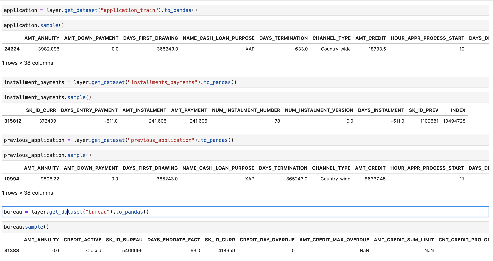
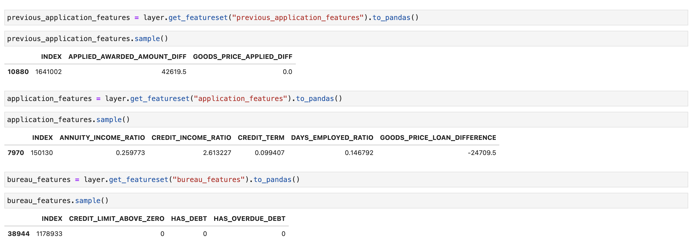
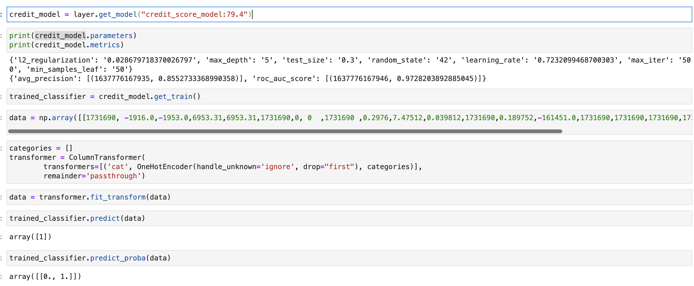
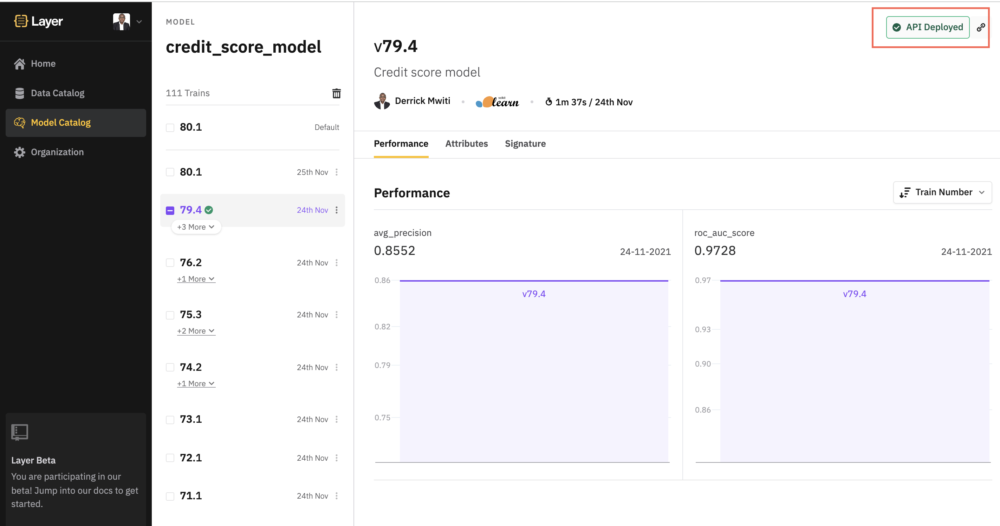
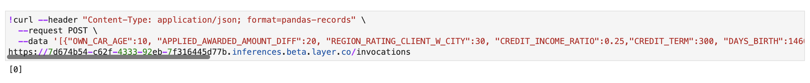

## How to use Layer entities in a Jupyter Notebook
Layer allows us to fetch and re-use all the entities that are generated when we run our project. In this tutorial, we will
look at how we can fetch all the entities that resulted from running the credit score project. 

### Install Layer
Ensure that you have the latest version of [Layer](https://layer.co/) by following these [installation instructions](https://docs.beta.layer.co/docs/quickstart#install-layer-sdk). 

## Fetch datasets
We can fetch all the datasets used in the credit score project using the `layer.get_dataset` function. Using the `to_pandas()`
function fetches the data as a Pandas DataFrame. 

```python
import layer
application = layer.get_dataset("application_train").to_pandas()
installment_payments = layer.get_dataset("installments_payments").to_pandas()
previous_application = layer.get_dataset("previous_application").to_pandas()
bureau = layer.get_dataset("bureau").to_pandas()
```


### Fetch features
Features are fetched using the `layer.get_featureset` function. The function expects the name of the featureset. The 
`to_pandas` function fetches the features as a Pandas DataFrame. 
```python
previous_application_features = layer.get_featureset("previous_application_features").to_pandas()
application_features = layer.get_featureset("application_features").to_pandas()
bureau_features = layer.get_featureset("bureau_features").to_pandas()
```


### Fetch model
Models are fetched using the `layer.get_model` function. The fucntion expects the name of the model and an optional model 
version. `79.4` is the model version in this case.
```python
credit_model = layer.get_model("credit_score_model:79.4")
```
After fetching the model, you can use it to make predictions on new data. 
```python
import numpy as np
from sklearn.compose import ColumnTransformer
from sklearn.preprocessing import OneHotEncoder
trained_classifier = credit_model.get_train()
data = np.array([[1731690, -1916.0,-1953.0,6953.31,6953.31,1731690,0, 0  ,1731690 ,0.2976,7.47512,0.039812,1731690,0.189752,-161451.0,1731690,1731690,1731690,1731690,1,-16074.0, 1731690, 0.0, 1 ]])
categories = []
transformer = ColumnTransformer(
        transformers=[('cat', OneHotEncoder(handle_unknown='ignore', drop="first"), categories)],
        remainder='passthrough')
data = transformer.fit_transform(data)
trained_classifier.predict(data)
trained_classifier.predict_proba(data)
```


You can also use the model URL endpoint to make predictions. The URL is obtained the model catalog after deploying the 
model.


```python
!curl --header "Content-Type: application/json; format=pandas-records" \
  --request POST \
  --data '[{"OWN_CAR_AGE":10, "APPLIED_AWARDED_AMOUNT_DIFF":20, "REGION_RATING_CLIENT_W_CITY":30, "CREDIT_INCOME_RATIO":0.25,"CREDIT_TERM":300, "DAYS_BIRTH":14600, "cluster":0, "DAYS_EMPLOYED_RATIO":10000, "AMT_INSTALMENT":20, "DAYS_ID_PUBLISH":3000, "GOODS_PRICE_LOAN_DIFFERENCE":52, "AMT_PAYMENT":3000, "HAS_DEBT":0, "REG_CITY_NOT_WORK_CITY":1, "AMT_CREDIT_SUM_OVERDUE":0, "FLAG_DOCUMENT_3":1, "DAYS_ENTRY_PAYMENT":45789, "DAYS_REGISTRATION":9000, "LIVE_CITY_NOT_WORK_CITY":0, "DAYS_INSTALMENT":122, "ANNUITY_INCOME_RATIO":0.247, "GOODS_PRICE_APPLIED_DIFF":-258, "REGION_RATING_CLIENT":1, "CREDIT_LIMIT_ABOVE_ZERO":0}]' \
https://7d674b54-c62f-4333-92eb-7f316445d77b.inferences.beta.layer.co/invocations
```
