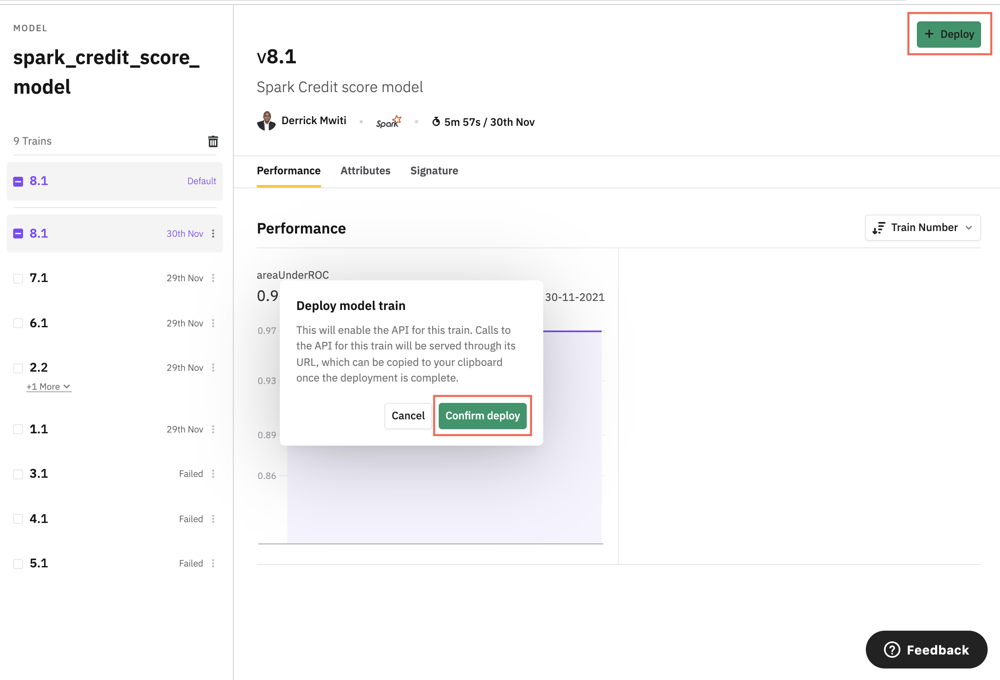

## Tutorial 7: How to create a Spark credit score model using existing features
In this tutorial we will look at how we can use the features that we have already created to build a credit score model
in [Spark](https://docs.beta.layer.co/docs/example-models). 
### Clone project starter
Clone the repo below to follow along with the tutorial:
```yaml
layer clone https://github.com/layerml/credit-score.git
cd credit-score/tutorials/7/before_tutorial
```
### Step 1: Create a models folder 
The only thing missing from the starter project is the Spark model. We'll house the model and it's configuration file in  
a `models` folder. Let's create the folder with the following files:
- The model YAML file. 
- The requirements file.
- The `model.py` file where we will define the Spark model.

After completing this step, you will have the following folder structure:
```yaml
.
|____.layer
| |____project.yaml
|____models
| |____credit_score
| | |____requirements.txt
| | |____credit_score_model.yaml
| | |____model.py
|____data
| |____installments
| | |____installments_data.yaml
| |____bureau
| | |____bureau.yaml
| |____application_train
| | |____application_data.yaml
| |____previous_application
| | |____previous_application_dataset.yaml
```
## Step 2: Define the model configuration
The next step is to define the model's configuration in a model YAML file. The file should declare the `type` as `model`. 
This is how Layer will know that it contains a model's configurations. Here is the complete model YAML file:
```yaml
apiVersion: 1
type: model
# Name and description of our model
name: "spark_credit_score_model"
description: "Spark credit score model"

training:
  name: spark_credit_score_model_training
  description: "Spark Model Training"

  # The source model definition file with a `train_model` method
  entrypoint: model.py

  # File includes the required python libraries with their correct versions
  environment: requirements.txt
    # The software and hardware environment needed for this training,
    # as defined in https://docs.beta.layer.co/docs/reference/fabrics
  fabric: "f-spark-medium"
```
Notice the use of a `f-spark-medium` [fabric](https://docs.beta.layer.co/docs/reference/fabrics) since this is a Spark 
project. 

Next, head over to the `model.py` file to start the model creation process. 
### Step 3: Fetch features and datasets as Spark DataFrames
In Layer, models are defined under the `train_model` function. The first step is to fetch the features and datasets as 
[Spark DataFrames](https://spark.apache.org/docs/latest/sql-programming-guide.html). The next step is to join the 
features and datasets to form the final DataFrame that will be used to train the model. 
```python
from typing import Any
from layer import Dataset, Train
import layer
from pyspark.ml.feature import VectorAssembler
from pyspark.ml.classification import GBTClassifier
from pyspark.ml.evaluation import BinaryClassificationEvaluator


def train_model(train: Train,
                application: Dataset("application_train"),
                bureau: Dataset("bureau"),
                installments: Dataset("installments_payments"),
                previous_application: Dataset("previous_application")
                ) -> Any:
    application_df = application.to_spark()

    previous_application_df = previous_application.to_spark()
    # Datasets
    installments_df = installments.to_spark()
    installments_df = installments_df[['SK_ID_PREV', 'SK_ID_CURR', 'DAYS_INSTALMENT', 'DAYS_ENTRY_PAYMENT',
                                       'AMT_INSTALMENT', 'AMT_PAYMENT']]
    bureau = bureau.to_spark()

    # Featuresets
    application_features_df = layer.get_featureset("application_features").to_spark()
    previous_application_features_df = layer.get_featureset("previous_application_features").to_spark()
    bureau_features = layer.get_featureset("bureau_features").to_spark()

    # Merge feature sets to the dataset
    application_data = application_df.join(application_features_df, ['INDEX'])
    # Select the most relevant columns
    application_data = application_data[['TARGET', 'SK_ID_CURR', 'ANNUITY_INCOME_RATIO', 'CREDIT_INCOME_RATIO',
                                         'CREDIT_TERM', 'DAYS_EMPLOYED_RATIO', 'GOODS_PRICE_LOAN_DIFFERENCE',
                                          'REGION_RATING_CLIENT_W_CITY', 'OWN_CAR_AGE', 'DAYS_BIRTH',
                                         'REGION_RATING_CLIENT', 'REG_CITY_NOT_WORK_CITY',
                                         'LIVE_CITY_NOT_WORK_CITY', 'DAYS_REGISTRATION', 'DAYS_ID_PUBLISH',
                                         'FLAG_DOCUMENT_3']]

    bureau_data = bureau.join(bureau_features, ['INDEX'])
    # Select the most relevant columns
    selected_bureau_sample = bureau_data[['SK_ID_CURR', 'CREDIT_LIMIT_ABOVE_ZERO', 'HAS_DEBT',
                                          'AMT_CREDIT_SUM_OVERDUE']]

    previous_application_data = previous_application_df.join(previous_application_features_df, ['INDEX'])
    # Select the most relevant columns
    p_application_df = previous_application_data[['SK_ID_PREV', 'SK_ID_CURR', 'APPLIED_AWARDED_AMOUNT_DIFF',
                                                         'GOODS_PRICE_APPLIED_DIFF']]

    # Join all of them
    dff = installments_df.join(selected_bureau_sample, ['SK_ID_CURR']).join(application_data, ['SK_ID_CURR']).join(
        p_application_df, ['SK_ID_PREV', 'SK_ID_CURR'])
    # Drop all null rows
    dff = dff.dropna()
```
### Step 4: Data preprocessing with Spark
Next, we need to transform the data into a format that will be accepted by the Spark model. This is done with the help 
of the [VectorAssembler](https://spark.apache.org/docs/3.1.1/api/python/reference/api/pyspark.ml.feature.VectorAssembler.html) 
that converts all the features into a single vector. 
```python
def train_model(train: Train,
                application: Dataset("application_train"),
                bureau: Dataset("bureau"),
                installments: Dataset("installments_payments"),
                previous_application: Dataset("previous_application")
                ) -> Any:
    application_df = application.to_spark()

    previous_application_df = previous_application.to_spark()
    # Datasets
    installments_df = installments.to_spark()
    installments_df = installments_df[['SK_ID_PREV', 'SK_ID_CURR', 'DAYS_INSTALMENT', 'DAYS_ENTRY_PAYMENT',
                                       'AMT_INSTALMENT', 'AMT_PAYMENT']]
    bureau = bureau.to_spark()

    # Featuresets
    application_features_df = layer.get_featureset("application_features").to_spark()
    previous_application_features_df = layer.get_featureset("previous_application_features").to_spark()
    bureau_features = layer.get_featureset("bureau_features").to_spark()

    # Merge feature sets to the dataset
    application_data = application_df.join(application_features_df, ['INDEX'])
    application_data = application_data[['TARGET', 'SK_ID_CURR', 'ANNUITY_INCOME_RATIO', 'CREDIT_INCOME_RATIO',
                                         'CREDIT_TERM', 'DAYS_EMPLOYED_RATIO', 'GOODS_PRICE_LOAN_DIFFERENCE',
                                          'REGION_RATING_CLIENT_W_CITY', 'OWN_CAR_AGE', 'DAYS_BIRTH',
                                         'REGION_RATING_CLIENT', 'REG_CITY_NOT_WORK_CITY',
                                         'LIVE_CITY_NOT_WORK_CITY', 'DAYS_REGISTRATION', 'DAYS_ID_PUBLISH',
                                         'FLAG_DOCUMENT_3']]

    bureau_data = bureau.join(bureau_features, ['INDEX'])
    selected_bureau_sample = bureau_data[['SK_ID_CURR', 'CREDIT_LIMIT_ABOVE_ZERO', 'HAS_DEBT',
                                          'AMT_CREDIT_SUM_OVERDUE']]

    previous_application_data = previous_application_df.join(previous_application_features_df, ['INDEX'])
    p_application_df = previous_application_data[['SK_ID_PREV', 'SK_ID_CURR', 'APPLIED_AWARDED_AMOUNT_DIFF',
                                                         'GOODS_PRICE_APPLIED_DIFF']]

    # Join all of them
    dff = installments_df.join(selected_bureau_sample, ['SK_ID_CURR']).join(application_data, ['SK_ID_CURR']).join(
        p_application_df, ['SK_ID_PREV', 'SK_ID_CURR'])
    # Drop all null rows
    dff = dff.dropna()
    # Obtain the X and y variables
    feat_cols = application_data.columns
    feat_cols.remove('TARGET')
    label_col = 'TARGET'
    # Data transformation
    vec_assember = VectorAssembler(inputCols=feat_cols, outputCol='features')
    final_data = vec_assember.transform(dff)
```
### Step 5: Split the data into a testing and training set
The next step is to split this dataset into a training and testing set. We can do this using the `randomSplit` function. 
```python

def train_model(train: Train,
                application: Dataset("application_train"),
                bureau: Dataset("bureau"),
                installments: Dataset("installments_payments"),
                previous_application: Dataset("previous_application")
                ) -> Any:
    application_df = application.to_spark()

    previous_application_df = previous_application.to_spark()
    # Datasets
    installments_df = installments.to_spark()
    installments_df = installments_df[['SK_ID_PREV', 'SK_ID_CURR', 'DAYS_INSTALMENT', 'DAYS_ENTRY_PAYMENT',
                                       'AMT_INSTALMENT', 'AMT_PAYMENT']]
    bureau = bureau.to_spark()

    # Featuresets
    application_features_df = layer.get_featureset("application_features").to_spark()
    previous_application_features_df = layer.get_featureset("previous_application_features").to_spark()
    bureau_features = layer.get_featureset("bureau_features").to_spark()

    # Merge feature sets to the dataset
    application_data = application_df.join(application_features_df, ['INDEX'])
    application_data = application_data[['TARGET', 'SK_ID_CURR', 'ANNUITY_INCOME_RATIO', 'CREDIT_INCOME_RATIO',
                                         'CREDIT_TERM', 'DAYS_EMPLOYED_RATIO', 'GOODS_PRICE_LOAN_DIFFERENCE',
                                          'REGION_RATING_CLIENT_W_CITY', 'OWN_CAR_AGE', 'DAYS_BIRTH',
                                         'REGION_RATING_CLIENT', 'REG_CITY_NOT_WORK_CITY',
                                         'LIVE_CITY_NOT_WORK_CITY', 'DAYS_REGISTRATION', 'DAYS_ID_PUBLISH',
                                         'FLAG_DOCUMENT_3']]

    bureau_data = bureau.join(bureau_features, ['INDEX'])
    selected_bureau_sample = bureau_data[['SK_ID_CURR', 'CREDIT_LIMIT_ABOVE_ZERO', 'HAS_DEBT',
                                          'AMT_CREDIT_SUM_OVERDUE']]

    previous_application_data = previous_application_df.join(previous_application_features_df, ['INDEX'])
    p_application_df = previous_application_data[['SK_ID_PREV', 'SK_ID_CURR', 'APPLIED_AWARDED_AMOUNT_DIFF',
                                                         'GOODS_PRICE_APPLIED_DIFF']]

    # Join all of them
    dff = installments_df.join(selected_bureau_sample, ['SK_ID_CURR']).join(application_data, ['SK_ID_CURR']).join(
        p_application_df, ['SK_ID_PREV', 'SK_ID_CURR'])
    # Drop all null rows
    dff = dff.dropna()
    # Obtain the X and y variables
    feat_cols = application_data.columns
    feat_cols.remove('TARGET')
    label_col = 'TARGET'
    vec_assember = VectorAssembler(inputCols=feat_cols, outputCol='features')
    final_data = vec_assember.transform(dff)
    # Split the data into a training and testing set
    training_size = 0.8
    random_state = 0
    test_size = 0.3
    training, testing = final_data.randomSplit([training_size, test_size], seed=random_state)
```
### Step 6: Log model parameters
Let's define and log the model parameters before creating the model. Logged parameters are used for comparing different 
model versions. The logged parameters can be seen on the model's page on the model catalog. 
```python
def train_model(train: Train,
                application: Dataset("application_train"),
                bureau: Dataset("bureau"),
                installments: Dataset("installments_payments"),
                previous_application: Dataset("previous_application")
                ) -> Any:

    application_df = application.to_spark()

    previous_application_df = previous_application.to_spark()
    # Datasets
    installments_df = installments.to_spark()
    installments_df = installments_df[['SK_ID_PREV', 'SK_ID_CURR', 'DAYS_INSTALMENT', 'DAYS_ENTRY_PAYMENT',
                                       'AMT_INSTALMENT', 'AMT_PAYMENT']]
    bureau = bureau.to_spark()

    # Featuresets
    application_features_df = layer.get_featureset("application_features").to_spark()
    previous_application_features_df = layer.get_featureset("previous_application_features").to_spark()
    bureau_features = layer.get_featureset("bureau_features").to_spark()

    # Merge feature sets to the dataset
    application_data = application_df.join(application_features_df, ['INDEX'])
    application_data = application_data[['TARGET', 'SK_ID_CURR', 'ANNUITY_INCOME_RATIO', 'CREDIT_INCOME_RATIO',
                                         'CREDIT_TERM', 'DAYS_EMPLOYED_RATIO', 'GOODS_PRICE_LOAN_DIFFERENCE',
                                          'REGION_RATING_CLIENT_W_CITY', 'OWN_CAR_AGE', 'DAYS_BIRTH',
                                         'REGION_RATING_CLIENT', 'REG_CITY_NOT_WORK_CITY',
                                         'LIVE_CITY_NOT_WORK_CITY', 'DAYS_REGISTRATION', 'DAYS_ID_PUBLISH',
                                         'FLAG_DOCUMENT_3']]

    bureau_data = bureau.join(bureau_features, ['INDEX'])
    selected_bureau_sample = bureau_data[['SK_ID_CURR', 'CREDIT_LIMIT_ABOVE_ZERO', 'HAS_DEBT',
                                          'AMT_CREDIT_SUM_OVERDUE']]

    previous_application_data = previous_application_df.join(previous_application_features_df, ['INDEX'])
    p_application_df = previous_application_data[['SK_ID_PREV', 'SK_ID_CURR', 'APPLIED_AWARDED_AMOUNT_DIFF',
                                                         'GOODS_PRICE_APPLIED_DIFF']]

    # Join all of them
    dff = installments_df.join(selected_bureau_sample, ['SK_ID_CURR']).join(application_data, ['SK_ID_CURR']).join(
        p_application_df, ['SK_ID_PREV', 'SK_ID_CURR'])
    # Drop all null rows
    dff = dff.dropna()
    # Obtain the X and y variables
    feat_cols = application_data.columns
    feat_cols.remove('TARGET')
    label_col = 'TARGET'
    vec_assember = VectorAssembler(inputCols=feat_cols, outputCol='features')
    final_data = vec_assember.transform(dff)
    # Split the data into a training and testing set
    training_size = 0.8
    random_state = 0
    test_size = 0.3
    training, testing = final_data.randomSplit([training_size, test_size], seed=random_state)
    # Model parameters
    labelCol = label_col
    featuresCol = 'features'
    maxDepth = 5
    maxBins = 32
    seed = 0
    maxIter = 20
    # Log parameters, these can be used for comparing different models on the model catalog
    train.log_parameters({
        "labelCol": labelCol,
        "featuresCol": featuresCol,
        "maxDepth": maxDepth,
        "maxBins": maxBins,
        "seed": seed,
        "maxIter": maxIter
    })
```
### Step 7: Model definition
Next, let's use these parameters to define a [GBTClassifier](https://spark.apache.org/docs/latest/api/python/reference/api/pyspark.ml.classification.GBTClassifier.html).
We can then train the model using the classifier's `fit` method. 
```python
def train_model(train: Train,
                application: Dataset("application_train"),
                bureau: Dataset("bureau"),
                installments: Dataset("installments_payments"),
                previous_application: Dataset("previous_application")
                ) -> Any:
  
    application_df = application.to_spark()

    previous_application_df = previous_application.to_spark()
    # Datasets
    installments_df = installments.to_spark()
    installments_df = installments_df[['SK_ID_PREV', 'SK_ID_CURR', 'DAYS_INSTALMENT', 'DAYS_ENTRY_PAYMENT',
                                       'AMT_INSTALMENT', 'AMT_PAYMENT']]
    bureau = bureau.to_spark()

    # Featuresets
    application_features_df = layer.get_featureset("application_features").to_spark()
    previous_application_features_df = layer.get_featureset("previous_application_features").to_spark()
    bureau_features = layer.get_featureset("bureau_features").to_spark()

    # Merge feature sets to the dataset
    application_data = application_df.join(application_features_df, ['INDEX'])
    application_data = application_data[['TARGET', 'SK_ID_CURR', 'ANNUITY_INCOME_RATIO', 'CREDIT_INCOME_RATIO',
                                         'CREDIT_TERM', 'DAYS_EMPLOYED_RATIO', 'GOODS_PRICE_LOAN_DIFFERENCE',
                                          'REGION_RATING_CLIENT_W_CITY', 'OWN_CAR_AGE', 'DAYS_BIRTH',
                                         'REGION_RATING_CLIENT', 'REG_CITY_NOT_WORK_CITY',
                                         'LIVE_CITY_NOT_WORK_CITY', 'DAYS_REGISTRATION', 'DAYS_ID_PUBLISH',
                                         'FLAG_DOCUMENT_3']]

    bureau_data = bureau.join(bureau_features, ['INDEX'])
    selected_bureau_sample = bureau_data[['SK_ID_CURR', 'CREDIT_LIMIT_ABOVE_ZERO', 'HAS_DEBT',
                                          'AMT_CREDIT_SUM_OVERDUE']]

    previous_application_data = previous_application_df.join(previous_application_features_df, ['INDEX'])
    p_application_df = previous_application_data[['SK_ID_PREV', 'SK_ID_CURR', 'APPLIED_AWARDED_AMOUNT_DIFF',
                                                         'GOODS_PRICE_APPLIED_DIFF']]

    # Join all of them
    dff = installments_df.join(selected_bureau_sample, ['SK_ID_CURR']).join(application_data, ['SK_ID_CURR']).join(
        p_application_df, ['SK_ID_PREV', 'SK_ID_CURR'])
    # Drop all null rows
    dff = dff.dropna()
    # Obtain the X and y variables
    feat_cols = application_data.columns
    feat_cols.remove('TARGET')
    label_col = 'TARGET'
    vec_assember = VectorAssembler(inputCols=feat_cols, outputCol='features')
    final_data = vec_assember.transform(dff)
    # Split the data into a training and testing set
    training_size = 0.8
    random_state = 0
    test_size = 0.3
    training, testing = final_data.randomSplit([training_size, test_size], seed=random_state)
    # Model parameters
    labelCol = label_col
    featuresCol = 'features'
    maxDepth = 5
    maxBins = 32
    seed = 0
    maxIter = 20
    # Log parameters, these can be used for comparing different models on the model catalog
    train.log_parameters({
        "labelCol": labelCol,
        "featuresCol": featuresCol,
        "maxDepth": maxDepth,
        "maxBins": maxBins,
        "seed": seed,
        "maxIter": maxIter
    })
    lr = GBTClassifier(labelCol=labelCol, featuresCol=featuresCol,
                       maxDepth=maxDepth, maxBins=maxBins, seed=seed, maxIter=maxIter)
    credit_model = lr.fit(training)
```
### Step 8: Log model evaluation metrics
Once the model has been trained successfully, we can evaluate it on the testing set and log the evaluation metrics.
Logging the metrics is important because you can use them to compare different model versions. 
````python
from typing import Any
from layer import Dataset, Train
import layer
from pyspark.ml.feature import VectorAssembler
from pyspark.ml.classification import GBTClassifier
from pyspark.ml.evaluation import BinaryClassificationEvaluator


def train_model(train: Train,
                application: Dataset("application_train"),
                bureau: Dataset("bureau"),
                installments: Dataset("installments_payments"),
                previous_application: Dataset("previous_application")
                ) -> Any:

    application_df = application.to_spark()

    previous_application_df = previous_application.to_spark()
    # Datasets
    installments_df = installments.to_spark()
    installments_df = installments_df[['SK_ID_PREV', 'SK_ID_CURR', 'DAYS_INSTALMENT', 'DAYS_ENTRY_PAYMENT',
                                       'AMT_INSTALMENT', 'AMT_PAYMENT']]
    bureau = bureau.to_spark()

    # Featuresets
    application_features_df = layer.get_featureset("application_features").to_spark()
    previous_application_features_df = layer.get_featureset("previous_application_features").to_spark()
    bureau_features = layer.get_featureset("bureau_features").to_spark()

    # Merge feature sets to the dataset
    application_data = application_df.join(application_features_df, ['INDEX'])
    application_data = application_data[['TARGET', 'SK_ID_CURR', 'ANNUITY_INCOME_RATIO', 'CREDIT_INCOME_RATIO',
                                         'CREDIT_TERM', 'DAYS_EMPLOYED_RATIO', 'GOODS_PRICE_LOAN_DIFFERENCE',
                                          'REGION_RATING_CLIENT_W_CITY', 'OWN_CAR_AGE', 'DAYS_BIRTH',
                                         'REGION_RATING_CLIENT', 'REG_CITY_NOT_WORK_CITY',
                                         'LIVE_CITY_NOT_WORK_CITY', 'DAYS_REGISTRATION', 'DAYS_ID_PUBLISH',
                                         'FLAG_DOCUMENT_3']]

    bureau_data = bureau.join(bureau_features, ['INDEX'])
    selected_bureau_sample = bureau_data[['SK_ID_CURR', 'CREDIT_LIMIT_ABOVE_ZERO', 'HAS_DEBT',
                                          'AMT_CREDIT_SUM_OVERDUE']]

    previous_application_data = previous_application_df.join(previous_application_features_df, ['INDEX'])
    p_application_df = previous_application_data[['SK_ID_PREV', 'SK_ID_CURR', 'APPLIED_AWARDED_AMOUNT_DIFF',
                                                         'GOODS_PRICE_APPLIED_DIFF']]

    # Join all of them
    dff = installments_df.join(selected_bureau_sample, ['SK_ID_CURR']).join(application_data, ['SK_ID_CURR']).join(
        p_application_df, ['SK_ID_PREV', 'SK_ID_CURR'])
    # Drop all null rows
    dff = dff.dropna()
    # Obtain the X and y variables
    feat_cols = application_data.columns
    feat_cols.remove('TARGET')
    label_col = 'TARGET'
    vec_assember = VectorAssembler(inputCols=feat_cols, outputCol='features')
    final_data = vec_assember.transform(dff)
    # Split the data into a training and testing set
    training_size = 0.8
    random_state = 0
    test_size = 0.3
    training, testing = final_data.randomSplit([training_size, test_size], seed=random_state)
    # Model parameters
    labelCol = label_col
    featuresCol = 'features'
    maxDepth = 5
    maxBins = 32
    seed = 0
    maxIter = 20
    # Log parameters, these can be used for comparing different models on the model catalog
    train.log_parameters({
        "labelCol": labelCol,
        "featuresCol": featuresCol,
        "maxDepth": maxDepth,
        "maxBins": maxBins,
        "seed": seed,
        "maxIter": maxIter
    })
    lr = GBTClassifier(labelCol=labelCol, featuresCol=featuresCol,
                       maxDepth=maxDepth, maxBins=maxBins, seed=seed, maxIter=maxIter)
    credit_model = lr.fit(training)
    predictions = credit_model.transform(testing)
    evaluator = BinaryClassificationEvaluator(labelCol=label_col)

    train.log_metric("areaUnderROC", evaluator.evaluate(predictions))

    return credit_model
````
### Step 9: Run the project 
The next step is to train this model. Layer projects are executed on the command line using the `layer start` command. 
Since we aren't building any new feature we can train the model using the `layer start model spark_credit_score_model` 
command. Once the model has been trained successfully, you will get a link to the model's page on the [model catalog](https://docs.beta.layer.co/docs/models/model-catalog). 
```yaml
(layer-env) derrickmwiti@Derricks-MacBook-Pro after_tutorial % layer start model spark_credit_score_model
Layer 0.8.14 using https://beta.layer.co
📁 Loading the project under /Users/derrickmwiti/PycharmProjects/Layer-videos/credit-score/tutorials/7/after_tutorial
🔎 Found 4 datasets, 0 featuresets and 1 model
📔 Session logs at /Users/derrickmwiti/.layer/logs/20211130T094724-session-6b65bfe7-51a3-46ba-b2eb-070beff9efd9.log
💾 Starting at 2021-11-30 09:47:26...
🔵 Pipeline run id: b9c0d3fd-dd06-4e85-a222-cdeb57e7b416
✅ 2021-11-30 09:47:27 | dataset  installments_payments          ━━━━━━━━━━━━━━━━━━━━━━ DONE      [410ms]             
✅ 2021-11-30 09:47:27 | dataset  bureau                         ━━━━━━━━━━━━━━━━━━━━━━ DONE      [773ms]             
✅ 2021-11-30 09:47:27 | dataset  application_train              ━━━━━━━━━━━━━━━━━━━━━━ DONE      [1129ms]            
✅ 2021-11-30 09:47:27 | dataset  previous_application           ━━━━━━━━━━━━━━━━━━━━━━ DONE      [1499ms]            
✅ 2021-11-30 09:47:34 | model    spark_credit_score_model       ━━━━━━━━━━━━━━━━━━━━━━ DONE      [371535ms]          
                                  https://beta.layer.co/models/fd22a83d-ac85-4cd4-b8e3-beef775398ad/trains/ef668038-5 
                                  d7f-4b04-8925-2d412d66e022                                                          
LAYER RUN SUCCEEDED in 379543ms

```
### Step 10: Deploy the  Spark model
Clicking the link returned on the command line will take you to the model page where you can deploy the model by clicking
the Deploy button. 



### Step 11: Run predictions on the Spark model 
You can run predictions on the Spark model by fetching the trained classifier and converting the test data into the format
that's expected by the Spark model.
```python 
import layer
from pyspark.ml.feature import VectorAssembler
from pyspark.sql import SQLContext
import pyspark
sc = pyspark.SparkContext.getOrCreate();
spark_credit_score_model = layer.get_model("spark_credit_score_model")
trained_classifier = spark_credit_score_model.get_train()
sqlContext  = SQLContext(sc)

test = sqlContext.createDataFrame([
    (1731690, -1916.0,-1953.0,6953.31,6953.31,1731690, 0  ,1731690 ,0.2976,7.47512,0.039812,1731690,0.189752,-161451.0,1731690,1731690,1731690,1731690,1,-16074.0, 1731690, 0.0, 1 ),
    ], ["OWN_CAR_AGE", "APPLIED_AWARDED_AMOUNT_DIFF", "REGION_RATING_CLIENT_W_CITY", "CREDIT_INCOME_RATIO","CREDIT_TERM", "DAYS_BIRTH", "DAYS_EMPLOYED_RATIO", "AMT_INSTALMENT", "DAYS_ID_PUBLISH", "GOODS_PRICE_LOAN_DIFFERENCE", "AMT_PAYMENT", "HAS_DEBT", "REG_CITY_NOT_WORK_CITY", "AMT_CREDIT_SUM_OVERDUE", "FLAG_DOCUMENT_3", "DAYS_ENTRY_PAYMENT", "DAYS_REGISTRATION", "LIVE_CITY_NOT_WORK_CITY", "DAYS_INSTALMENT", "ANNUITY_INCOME_RATIO", "GOODS_PRICE_APPLIED_DIFF", "REGION_RATING_CLIENT", "CREDIT_LIMIT_ABOVE_ZERO"
])
feat_cols = ["OWN_CAR_AGE", "APPLIED_AWARDED_AMOUNT_DIFF", "REGION_RATING_CLIENT_W_CITY", "CREDIT_INCOME_RATIO","CREDIT_TERM", "DAYS_BIRTH", "DAYS_EMPLOYED_RATIO", "AMT_INSTALMENT", "DAYS_ID_PUBLISH", "GOODS_PRICE_LOAN_DIFFERENCE", "AMT_PAYMENT", "HAS_DEBT", "REG_CITY_NOT_WORK_CITY", "AMT_CREDIT_SUM_OVERDUE", "FLAG_DOCUMENT_3", "DAYS_ENTRY_PAYMENT", "DAYS_REGISTRATION", "LIVE_CITY_NOT_WORK_CITY", "DAYS_INSTALMENT", "ANNUITY_INCOME_RATIO", "GOODS_PRICE_APPLIED_DIFF", "REGION_RATING_CLIENT", "CREDIT_LIMIT_ABOVE_ZERO"]
vec_assember = VectorAssembler(inputCols=feat_cols, outputCol='features')
test_data = vec_assember.transform(test)
predictions = trained_classifier.transform(test_data)
```

